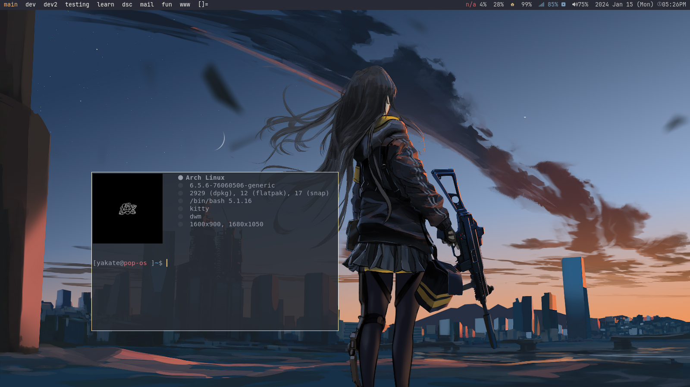
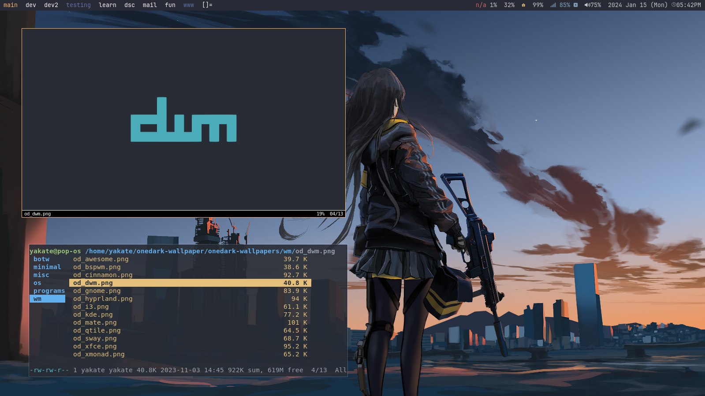
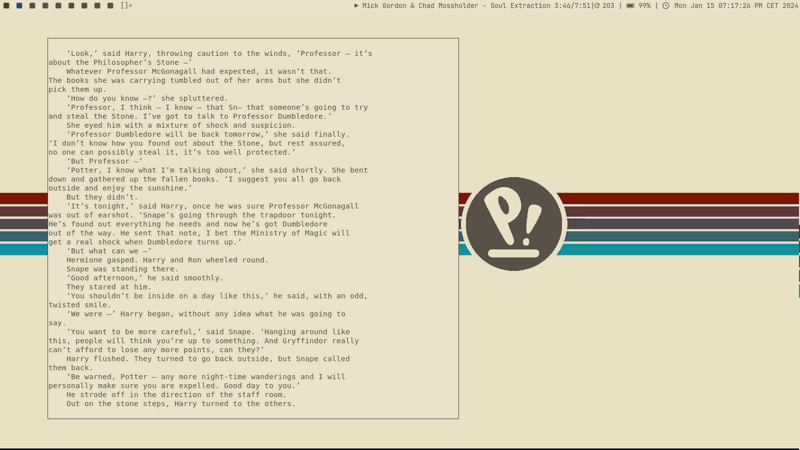

<div align="center">
  
</div>
<br>

<div align="center">

  
  
  


</div>


<div align="center">
These Dotfiles are for my personal use, and will not work on every machine. They will get better as I get better at linux in general.

## 

Some dwm screenshots:


</div>







> **Note:**
> 
> Please disable your compositor when using the oldbook color scheme
>
> also in the first two screenshots I was using linux dabbler's build of slstatus which can be found <a href="https://github.com/linuxdabbler/suckless" target=”_blank”>here</a> .


Bspwm is also using the onedark colorscheme. Sadly I can't take any screenshots of it because flameshot is breaking in bspwm for some reason.

## Dependencies:
on debian and ubuntu based systems:
```bash
sudo apt-get install build-essential libx11-dev libxinerama-dev sharutils suckless-tools libxft-dev stterm kitty emacs neovim bspwm polybar nautilus
```
on arch based systems:
```bash
sudo pacman -S base-devel git libx11 libxft xorg-server xorg-xinit kitty emacs neovim bspwm polybar nautilus
```
And for all the madman out there using gentoo, follow the <a href="https://wiki.gentoo.org/wiki/Dwm">instructions</a> on the gentoo wiki! Have fun compiling!

My build also uses the <a href="https://www.nerdfonts.com">Jet Brains Mono Nerd Font </a>.

